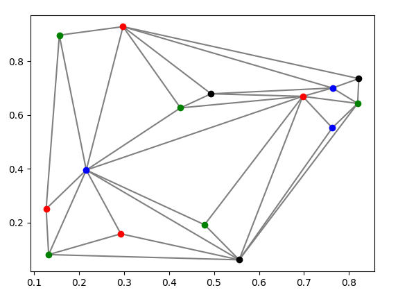

# Sudoku, Map Coloring and Einstein-Problem Solver

The following program contains backtracking algorithm able to solve 
*sudokus*, *map coloring* problems and *Einstein's problem*.

## Backtracking algorithm
Proposed backtracking is a simple algorithm, based on recursion. 
The algorithm can take multiple constraints, which are separated into three categories 
- single variable constraint
- two variables dependency
- multiple variables dependency

## Sudoku Solver
Example of solving sudoku is presented in *SudokuSolver.py* file.  

Examplary result:  
Initial state:  
[0, 7, 0, 0, 2, 0, 9, 0, 0]  
[0, 4, 0, 8, 0, 6, 0, 0, 0]  
[0, 1, 2, 0, 0, 0, 3, 0, 0]  
[0, 0, 0, 0, 0, 0, 8, 7, 0]  
[0, 6, 0, 9, 7, 2, 0, 5, 0]  
[0, 2, 5, 0, 0, 0, 0, 0, 0]  
[0, 0, 1, 0, 0, 0, 2, 9, 0]  
[0, 0, 0, 5, 0, 4, 0, 3, 0]  
[0, 0, 7, 0, 6, 0, 0, 1, 0]  

Solved:  
[8, 7, 6, 1, 2, 3, 9, 4, 5]  
[5, 4, 3, 8, 9, 6, 7, 2, 1]  
[9, 1, 2, 7, 4, 5, 3, 8, 6]  
[3, 9, 4, 6, 5, 1, 8, 7, 2]  
[1, 6, 8, 9, 7, 2, 4, 5, 3]  
[7, 2, 5, 4, 3, 8, 1, 6, 9]  
[6, 5, 1, 3, 8, 7, 2, 9, 4]  
[2, 8, 9, 5, 1, 4, 6, 3, 7]  
[4, 3, 7, 2, 6, 9, 5, 1, 8]  

## Map coloring
Example of map coloring problem is presented in *MapTest.py* file. *Map.py* creates new instance of map coloring problem.

Examplary outcome for 15 points and 4 colors:  

## Einstein's problem
Einstein's problem/Zebra puzzle/Einstein's riddle description:  
https://en.wikipedia.org/wiki/Zebra_Puzzle  

Example of Einstein's problem is presented in *EinsteinTest.py* file.  

Solution (in polish):  
domek 1:
Norweg żółty cygaro woda koty  
domek 2:
Duńczyk niebieski light herbata konie  
domek 3:
Anglik czerwony bez_filtra mleko ptaki  
domek 4:
Niemiec zielony fajka kawa rybki  
domek 5:
Szwed biały menthol piwo psy
